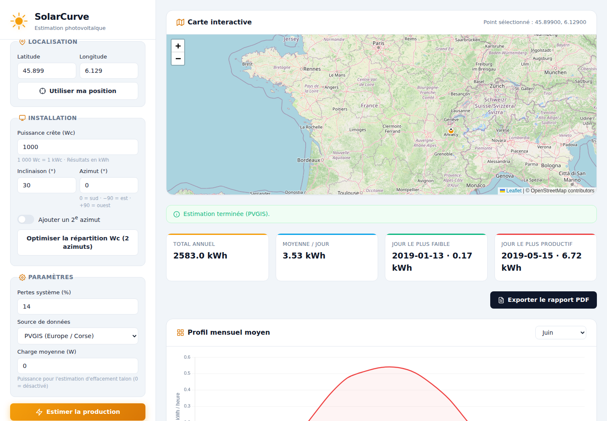

<div align="center">

# ☀️ SolarCurve

**Combien produira réellement une installation photovoltaïque, heure par heure, toute l'année ?**

Estimez la courbe de production solaire quotidienne pour n'importe quelle
position GPS, en fonction de la puissance installée, de l'inclinaison et
de l'orientation des panneaux — à partir de données météo réelles
(PVGIS/PVWatts), pas d'une moyenne approximative.

### 👉 [**solar.remcorp.fr**](https://solar.remcorp.fr) 👈

[](https://github.com/Rem7474/SolarCurve/actions/workflows/ci.yml)

</div>

<br>



## Pourquoi cet outil ?

Une estimation solaire à la louche (« kWc × 1000 heures d'ensoleillement »)
ignore la latitude, la saison, l'inclinaison réelle du toit et l'azimut.
Deux toits avec la même puissance installée peuvent produire très
différemment selon qu'ils regardent plein sud ou sud-ouest. SolarCurve
interroge PVGIS (données Copernicus/JRC) ou PVWatts (NREL) pour obtenir
une vraie courbe horaire, jour par jour sur l'année, et permet de comparer
deux orientations côte à côte.

## Ce que vous pouvez faire

- 📍 Saisir une position (latitude/longitude), par géolocalisation ou en
  cliquant directement sur la carte
- ⚙️ Configurer puissance (kWc), inclinaison, azimut et pertes système
- 🔀 **Comparer deux azimuts** : deux courbes superposées, plus une courbe
  somme des deux
- 📅 Parcourir les jours calculés de l'année via un slider, avec les
  courbes limites (21 juin / 21 décembre) affichées en repère
- 📊 Consulter les totaux annuels, la moyenne journalière, et les
  meilleurs/plus faibles jours

## Sources de données

- **PVGIS** (priorité, idéal Europe/Corse) — gratuit, sans clé API
- **PVWatts** en fallback — nécessite une clé API NREL gratuite

## Démarrage rapide

### Prérequis

- **Node.js `^20.19.0` ou `>=22.12.0`** — requis par Vite 8 (son bundler
  `rolldown` utilise `util.styleText`, disponible seulement à partir de
  Node 20.12+). Vérifiez avec `node -v`.
- **npm** (fourni avec Node.js) et **git**.

```bash
nvm install 22 && nvm use 22   # si votre Node système est trop ancien
git clone https://github.com/Rem7474/SolarCurve.git
cd SolarCurve
npm install
npm run dev      # http://localhost:5173
```

L'application appelle exclusivement les routes same-origin `/api/pvgis`
et `/api/pvwatts` (voir [Notes API](#notes-api) plus bas) — **ce dépôt ne
contient pas leur implémentation serveur**. Pour développer en local avec
de vraies données, faites tourner un proxy sur `http://localhost:8787`
(cible configurée dans `vite.config.js`) qui relaie vers PVGIS/PVWatts, ou
adaptez la cible du proxy Vite vers votre propre backend.

```bash
npm run build    # build de production dans dist/
npm run preview  # sert le build de production en local
npm run lint     # ESLint
npm run format   # Prettier (--write)
npm test         # Vitest
```

Documentation complémentaire : [audit du code existant](docs/AUDIT.md) et
[architecture cible / plan de migration](docs/ARCHITECTURE.md).

## Notes API

L'application appelle d'abord des routes locales same-origin, obligatoires
pour éviter le blocage CORS côté navigateur :

- `/api/pvgis` → `https://re.jrc.ec.europa.eu/api/v5_3/seriescalc`, avec
  `pvcalculation=1` (sinon PVGIS ne renvoie que l'irradiation, pas la
  puissance PV). Année de référence 2020, pas horaire, agrégé en
  production quotidienne.
- `/api/pvwatts` (fallback) → `https://developer.nrel.gov/api/pvwatts/v8.json`,
  clé API NREL requise. Timeframe `hourly`, agrégé en production
  quotidienne.

## Convention d'azimut

- **0° = Sud**, **-90° = Est**, **+90° = Ouest**, **±180° = Nord**

La conversion interne est appliquée selon l'API choisie.

## Limites

- Estimation basée sur données météo historiques/modèles, pas une
  prévision en temps réel
- Ne remplace pas une étude de dimensionnement détaillée
- Les ombrages locaux fins ne sont pas modélisés

## Déploiement production (important CORS)

Si vous déployez sur un domaine public (ex : `https://solar.remcorp.fr`),
il faut exposer un proxy same-origin :

- `GET /api/pvgis` → proxy vers `https://re.jrc.ec.europa.eu/api/v5_3/seriescalc`
- `GET /api/pvwatts` → proxy vers `https://developer.nrel.gov/api/pvwatts/v8.json`

L'application est configurée pour utiliser exclusivement ces routes
`/api/*`.
